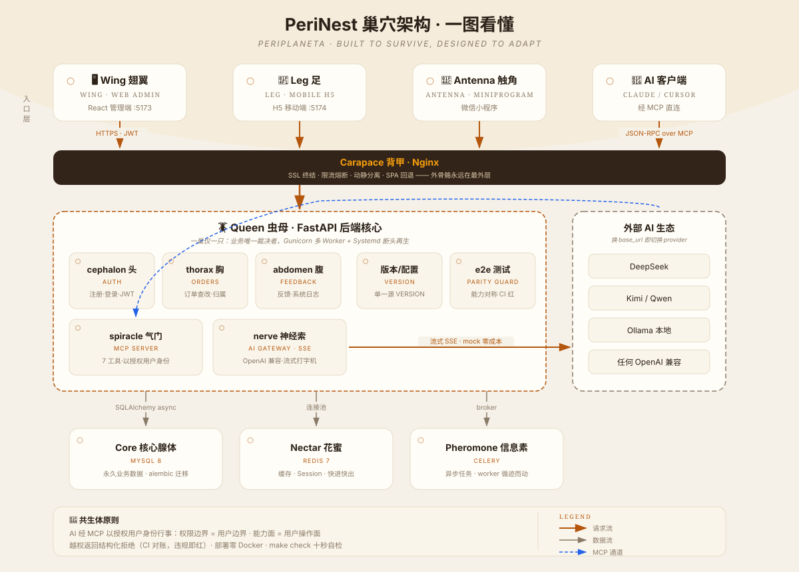

# PeriNest

English | [中文](README.md)

> [](https://github.com/steptian/PeriNest/actions/workflows/ci.yml)
>   
>
> *Built to Survive, Designed to Adapt.*


**This framework is built for the AI development era.**

| You bring | PeriNest provides |
|:---|:---|
| An idea + an AI agent | A stable, production-ready 4-terminal system |

- **Wheels pre-built** — 4-terminal skeleton / auth / AI gateway / deploy / CI out of the box
- **Principles self-enforcing** — the Symbiont Principle is guarded by tests: violations turn red in 10 seconds locally, not by discipline
- **Knowledge pre-compiled** — `AGENTS.md` knowledge base + `make check`: any AI onboards in seconds, iterates safely

> Mission: **let everyone build stable, reliable systems fast — with AI.**

A 4-terminal monorepo: **Queen** (FastAPI backend) + **Wing** (React admin) + **Antenna** (WeChat mini-program) + **Leg** (mobile H5).
Zero-Docker deployment: native venv + Systemd + Nginx.

## 🗺 Architecture at a Glance

<p align="center">
  
</p>
<p align="center"><sub>4 terminals → Carapace (Nginx) → Queen (five organs) → nest infrastructure · AI ecosystem via the spiracle</sub></p>

## 📸 Demo

<p align="center">
  
  
</p>
<p align="center">
  
  
</p>
<p align="center"><sub>Wing dashboard · Leg mobile AI streaming chat (light/dark themes)</sub></p>

## 📖 The Nest Compendium · Every Name Is an Organ

**The story begins with one question: why a cockroach?**

Eagles need wind. Wolves need packs. Whales need oceans.
**A cockroach needs nothing.**
It is not fast, not strong, not beautiful — yet it outlived 300 million years
and four mass extinctions with one survival system:
a rock-solid core, sensitive antennae, a regenerable body, zero dependence on any environment.

**PeriNest translates that survival system into software architecture.**
Etymology: **Peri**planeta (the Latin genus of cockroaches) + **Nest**.

### Anatomy of a Cockroach

| Organ | What it does in the body | Why it owns this job |
|:---|:---|:---|
| **Queen** · backend | One per nest; bears all offspring; if she dies, the nest dies | The sole arbiter of business logic — hence strong consistency and Systemd's "regeneration" guard |
| **Wing** · web admin | Flies high, sees far | Dashboards & operations; wings never digest food — **the frontend owns no business logic** |
| **Antenna** · mini-program | The most sensitive nerve endings, sensing by touch | The WeChat probe: scan, LBS, push — all "touch" gestures |
| **Leg** · H5 | Six legs, climbs any surface | Any browser, no install, no review — six legs, lose one, still walking |
| **Nerve** · AI gateway | The nerve cord runs the whole body — even commands limbs after decapitation | AI runs through all four terminals; SSE streaming = nerve signals relaying segment by segment |
| **Spiracle** · MCP | The organ that exchanges gas with the outside world | The MCP endpoint = the breathing pore for exchanging tools with the AI ecosystem (Claude/Cursor) |
| **Core gland** · MySQL | Glands secrete and store life substances | Permanent business data — the nest's memory |
| **Nectar** · Redis | Quick energy, never stored forever | Cache / sessions / locks — fast in, fast out, expiring by design |
| **Pheromone** · Celery | Leaves chemical trails for others to follow | Async task queues: heavy work leaves a signal, workers follow the trail |
| **Carapace** · Nginx | The exoskeleton is always the outermost layer | First line of defense: TLS termination, rate-limiting, static assets |

### The Life Cycle: Incomplete Metamorphosis

Cockroaches have no pupa stage — **each molt keeps the old form while growing the new.**
That is PeriNest's release philosophy:

`Egg` (dev) → `Nymph` (test) → `Pupa` (staging) → `Imago` (production)

Every deploy is a molt: smooth upgrades, rollback ready, **never a rewrite from scratch.**

### Why Amber UI?

A cockroach's most romantic ending is being sealed in resin for 300 million years.
So the interface is a **digital amber museum**: every AI reply is an `EXHIBIT`,
dark mode is the depths of the resin, the paper tone is an old field guide,
and the login page reads `since 300 Ma`.

> *Built to Survive* — resilience: self-healing, rate-limits, zero dependencies.
> *Designed to Adapt* — adaptation: four terminals, staged environments, evolving AI.

---

## ✨ Why PeriNest

**Not an empty skeleton — a production starting point with full-chain verification.**

### 🛑 Stop Reinventing the Wheel

Every new project rewrites auth, reconfigures JWT, rebuilds the admin panel, re-integrates AI streaming, rewrites deploy scripts — **PeriNest has all these wheels built and verified**:

| Wheel you stop building | PeriNest delivers |
|:---|:---|
| Auth / JWT / login | Out of the box, incl. WeChat wx.login dual-channel |
| Admin + H5 + mini-program | 4 terminals, one repo, isomorphic API layer |
| AI streaming chat (SSE) | Nerve gateway + dual-terminal UI, zero-key mock mode |
| Deploy scripts / process guard / Nginx | Full `deploy/` suite, no Docker |
| CI pipeline | GitHub Actions 4-job matrix |
| Version management | Single VERSION source, auto-synced to all terminals |

**Spend your time on real business logic — not the 1000th login page of your career.**

### 🧬 Four Terminals, Architecture You Read From the Names

**Queen** (decision core) · **Wing** (web admin) · **Antenna** (WeChat mini-program) · **Leg** (mobile H5).
The ecological metaphor runs through code, directories, and docs — read the naming once, and the architecture diagram is already in your head.

### 📦 Zero Docker, Runs on a 1C1G Server

No container runtime, no image builds, no K8s manifests.
Native venv + Systemd (3s auto-restart) + Nginx (SSL / rate-limit / static assets).
**Half the ops cost, zero deployment anxiety.**

### 🚀 Verified Out of the Box

- Register → login → JWT → order → DB: **real e2e tests, all passing**
- Strict-mode tsc builds with zero errors
- WeChat wx.login dual-channel ready

### 🧠 AI Native: AI Is a First-Class Citizen (Symbiont Principle)

**AI-native is not "an AI entry point in the system" — it's AI working *as you*.**
Cockroaches carry real symbiotic bacteria: they feed on what the host eats and digest for it.
PeriNest's AI accesses data with **the authorizing user's permissions** and acts on their behalf:
- **Capability parity**: whatever you can do in the UI, AI can do via MCP (CI-enforced, gaps turn red)
- **Shared permission source**: AI's boundary = your boundary — cross-access returns a structured denial, never silent

- Unified AI gateway: one OpenAI-compatible adapter for DeepSeek / Kimi / Qwen / Ollama
- **SSE streaming typewriter**: `/api/v1/ai/chat/stream`, shared by all terminals
- Leg chat page + Wing assistant drawer — **chat the moment you open it**
- No API key? Auto mock mode — **CI and demos run the real chain at zero cost**
- 🧲 **MCP Server (Spiracle)**: 7 tools covering the user surface (identity / orders CRUD / feedback / AI) — **Claude / Cursor connect and work for you**, zero extra dependencies

### 🔒 Contract-Driven

Queen's Pydantic schemas auto-generate OpenAPI → `openapi-typescript` converts to Wing TS types.
Backend changes a field, frontend types turn red instantly.

### 🪳 Cockroach Survival Philosophy, in Engineering Detail

| Survival rule | Engineering implementation |
|:---|:---|
| Regenerate (headless) | Gunicorn max_requests worker recycling |
| Adapt to environment | Egg → Nymph → Pupa → Imago stage configs |
| Exoskeleton defense | Nginx rate-limit + JWT + strict layering |
| Pheromone cooperation | Celery async tasks, zero blocking |

## Quick Start

### Queen (backend)

```bash
cd queen
python3 -m venv .venv && source .venv/bin/activate
pip install .
cp .env.example .env       # fill MySQL/Redis config
alembic upgrade head
uvicorn app.main:app --reload
# docs: http://localhost:8000/docs
```

### Wing / Leg (web & mobile)

```bash
cd wing && npm install && npm run dev    # http://localhost:5173
cd leg  && npm install && npm run dev    # http://localhost:5174
```

### Antenna (WeChat mini-program)

Import the `antenna/` directory in WeChat DevTools, fill in your appid (`project.config.json`).

## Verify

```bash
cd queen && .venv/bin/python -m pytest tests/ -v   # full-chain smoke
cd wing && npm run build                            # admin build
cd leg  && npm run build                            # H5 build
cd antenna && ./node_modules/.bin/tsc --noEmit      # mini-program typecheck
```

## Docs

Architecture: `docs/技术架构.md` (Chinese) · Deployment: `deploy/DEPLOYMENT.md`

---

## ☕ Buy the Author a Tea

If this project helps you, scan to support the nest 🪳 (WeChat Pay)


