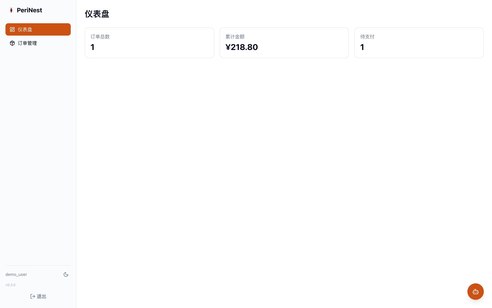
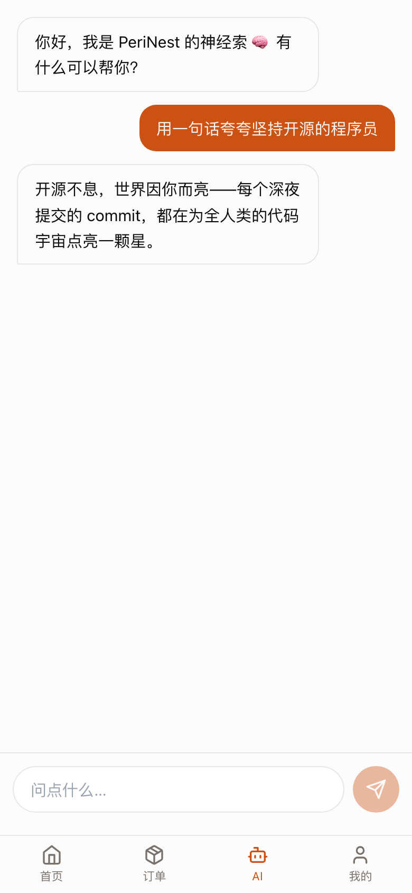
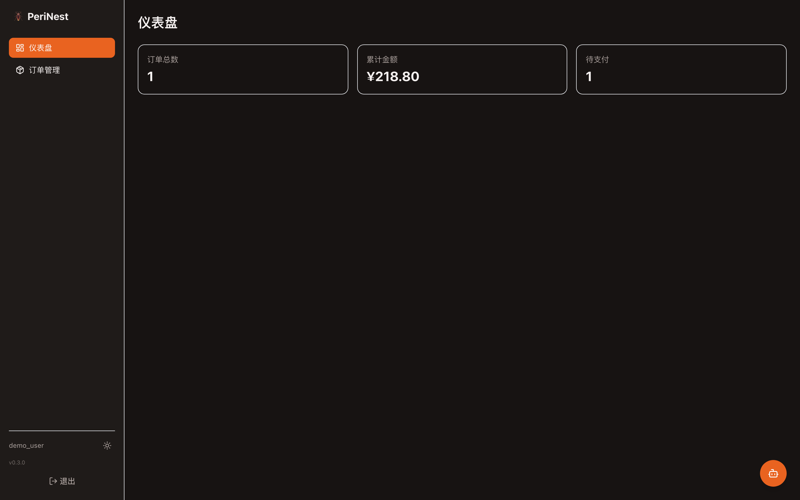
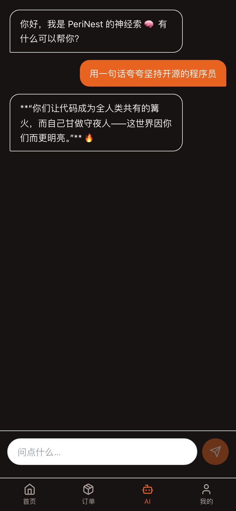

# PeriNest

English | [中文](README.md)

> [](https://github.com/steptian/PeriNest/actions/workflows/ci.yml)
>   
>
> *Built to Survive, Designed to Adapt.*

A 4-terminal monorepo: **Queen** (FastAPI backend) + **Wing** (React admin) + **Antenna** (WeChat mini-program) + **Leg** (mobile H5).
Zero-Docker deployment: native venv + Systemd + Nginx.

## 📸 Demo

<p align="center">
  
  
</p>
<p align="center">
  
  
</p>
<p align="center"><sub>Wing dashboard · Leg mobile AI streaming chat (light/dark themes)</sub></p>

## ✨ Why PeriNest

**Not an empty skeleton — a production starting point with full-chain verification.**

### 🛑 Stop Reinventing the Wheel

Every new project rewrites auth, reconfigures JWT, rebuilds the admin panel, re-integrates AI streaming, rewrites deploy scripts — **PeriNest has all these wheels built and verified**:

| Wheel you stop building | PeriNest delivers |
|:---|:---|
| Auth / JWT / login | Out of the box, incl. WeChat wx.login dual-channel |
| Admin + H5 + mini-program | 4 terminals, one repo, isomorphic API layer |
| AI streaming chat (SSE) | Nerve gateway + dual-terminal UI, zero-key mock mode |
| Deploy scripts / process guard / Nginx | Full `deploy/` suite, no Docker |
| CI pipeline | GitHub Actions 4-job matrix |
| Version management | Single VERSION source, auto-synced to all terminals |

**Spend your time on real business logic — not the 1000th login page of your career.**

### 🧬 Four Terminals, Architecture You Read From the Names

**Queen** (decision core) · **Wing** (web admin) · **Antenna** (WeChat mini-program) · **Leg** (mobile H5).
The ecological metaphor runs through code, directories, and docs — read the naming once, and the architecture diagram is already in your head.

### 📦 Zero Docker, Runs on a 1C1G Server

No container runtime, no image builds, no K8s manifests.
Native venv + Systemd (3s auto-restart) + Nginx (SSL / rate-limit / static assets).
**Half the ops cost, zero deployment anxiety.**

### 🚀 Verified Out of the Box

- Register → login → JWT → order → DB: **real e2e tests, all passing**
- Strict-mode tsc builds with zero errors
- WeChat wx.login dual-channel ready

### 🧠 AI Native: The Nerve Cord Is Built In

- Unified AI gateway: one OpenAI-compatible adapter for DeepSeek / Kimi / Qwen / Ollama
- **SSE streaming typewriter**: `/api/v1/ai/chat/stream`, shared by all terminals
- Leg chat page + Wing assistant drawer — **chat the moment you open it**
- No API key? Auto mock mode — **CI and demos run the real chain at zero cost**
- 🧲 **MCP Server (Spiracle)**: `/api/v1/mcp` exposes order queries, health checks, and AI chat as MCP tools — **Claude / Cursor connect straight to your backend**, zero extra dependencies

### 🔒 Contract-Driven

Queen's Pydantic schemas auto-generate OpenAPI → `openapi-typescript` converts to Wing TS types.
Backend changes a field, frontend types turn red instantly.

### 🪳 Cockroach Survival Philosophy, in Engineering Detail

| Survival rule | Engineering implementation |
|:---|:---|
| Regenerate (headless) | Gunicorn max_requests worker recycling |
| Adapt to environment | Egg → Nymph → Pupa → Imago stage configs |
| Exoskeleton defense | Nginx rate-limit + JWT + strict layering |
| Pheromone cooperation | Celery async tasks, zero blocking |

## Quick Start

### Queen (backend)

```bash
cd queen
python3 -m venv .venv && source .venv/bin/activate
pip install .
cp .env.example .env       # fill MySQL/Redis config
alembic upgrade head
uvicorn app.main:app --reload
# docs: http://localhost:8000/docs
```

### Wing / Leg (web & mobile)

```bash
cd wing && npm install && npm run dev    # http://localhost:5173
cd leg  && npm install && npm run dev    # http://localhost:5174
```

### Antenna (WeChat mini-program)

Import the `antenna/` directory in WeChat DevTools, fill in your appid (`project.config.json`).

## Verify

```bash
cd queen && .venv/bin/python -m pytest tests/ -v   # full-chain smoke
cd wing && npm run build                            # admin build
cd leg  && npm run build                            # H5 build
cd antenna && ./node_modules/.bin/tsc --noEmit      # mini-program typecheck
```

## Docs

Architecture: `docs/技术架构.md` (Chinese) · Deployment: `deploy/DEPLOYMENT.md`

---

## ☕ Buy the Author a Tea

If this project helps you, scan to support the nest 🪳 (WeChat Pay)


